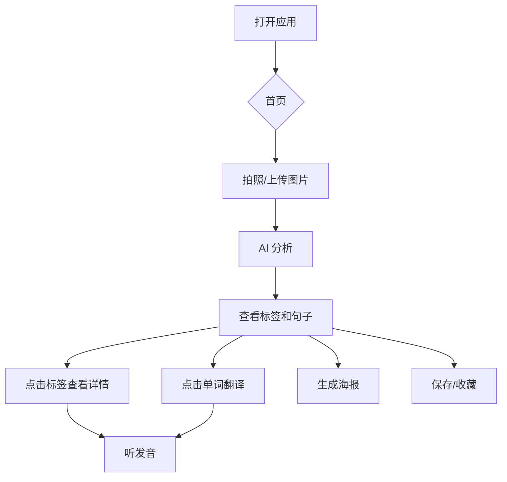

# PhotoAITalk - 产品需求文档
# PhotoAITalk - Product Requirements Document

---

## 🌍 产品愿景 | Product Vision

**中文**：通过 AI 让语言学习回归生活场景，拍照即学。

**English**: Bring language learning back to real-life contexts with AI-powered photo analysis.

---

## 🎯 目标用户 | Target Users

| 用户类型 | Description |
|----------|-------------|
| 语言初学者 | Beginners wanting contextual vocabulary |
| 旅行爱好者 | Travelers learning destination languages |
| 视觉学习者 | Visual learners preferring image-based study |

---

## ✨ 核心功能 | Core Features

### 1. 📷 拍照识别 | Photo Analysis
- 用户上传/拍摄图片
- AI 识别 3-5 个关键物体
- 显示目标语言 + 母语翻译
- 物体位置标注（可点击标签）

### 2. 💬 AI 造句 | AI Sentence Generation
三种风格的句子：
| Persona | 描述 |
|---------|------|
| 🌱 Beginner | 简单句，包含识别到的词汇 |
| 🤓 Grammar Geek | 日常对话风格，复杂语法结构 |
| 🎭 Poetic Master | 诗意、隐喻性表达 |

### 3. 🔊 语音朗读 | Text-to-Speech
- 点击播放任意单词/句子
- 自动识别语言（中/英/日/韩）
- iOS 使用系统 TTS，桌面使用后端 AI TTS

### 4. 📖 单词点击翻译 | Word Tap Translation
- 点击句子中的任意单词
- 弹出翻译卡片
- 支持保存到收藏

### 5. 🖼️ 海报生成 | Poster Generation
- 选择喜欢的句子
- 生成精美分享海报
- 支持两种布局（叠加/下方）
- iOS 长按保存到相册

### 6. 💾 学习笔记管理 | Learning Notes
- 自动保存所有学习记录
- 首页瀑布流展示
- 支持收藏/掌握标记
- 支持搜索

---

## 🔧 技术架构 | Tech Stack

```
Frontend: React + TypeScript + Tailwind CSS
Backend: Node.js + Express
AI: Tongyi Qianwen (通义千问) / Google Gemini (备用)
TTS: Browser Web Speech API + Backend AI TTS
Storage: IndexedDB (with localStorage fallback, PWA ready)
```

---

## 📱 平台支持 | Platform Support

- ✅ 移动端 Web (iOS Safari, Android Chrome)
- ✅ 桌面端 Web (Chrome, Firefox, Edge)
- ✅ PWA 离线支持

---

## 📊 用户流程 | User Flow



---

## 🚀 未来迭代 | Future Iterations

| 优先级 | 功能 | Description |
|--------|------|-------------|
| P1 | 云端同步 | Cross-device sync |
| P1 | 用户账号 | User authentication |
| P2 | 复习模式 | Spaced repetition review |
| P2 | 社区分享 | Community sharing |
| P3 | 更多语言 | More language pairs |

---

**Version**: Demo 1.0  
**Last Updated**: 2025-12-06
