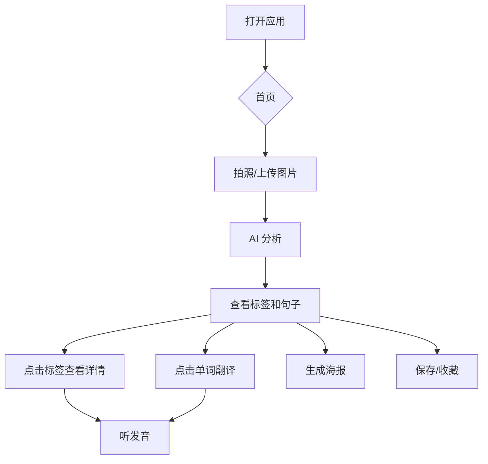

# PhotoAITalk - 产品需求文档
# PhotoAITalk - Product Requirements Document

---

## 🌍 产品愿景 | Product Vision

**中文**：通过 AI 让语言学习回归生活场景，拍照即学。

**English**: Bring language learning back to real-life contexts with AI-powered photo analysis.

---

## 🎯 目标用户 | Target Users

| 用户类型 | Description |
|----------|-------------|
| 语言初学者 | Beginners wanting contextual vocabulary |
| 旅行爱好者 | Travelers learning destination languages |
| 视觉学习者 | Visual learners preferring image-based study |

---

## ✨ 核心功能 | Core Features

### 1. 📷 拍照识别 | Photo Analysis
- 用户上传/拍摄图片
- AI 识别 3-5 个关键物体
- 显示目标语言 + 母语翻译
- 物体位置标注（可点击标签）

### 2. 💬 AI 造句 | AI Sentence Generation
三种风格的句子：
| Persona | 描述 |
|---------|------|
| 🌱 Beginner | 简单句，包含识别到的词汇 |
| 🤓 Grammar Geek | 日常对话风格，复杂语法结构 |
| 🎭 Poetic Master | 诗意、隐喻性表达 |

### 3. 🔊 语音朗读 | Text-to-Speech
- 点击播放任意单词/句子
- 自动识别语言（中/英/日/韩）
- iOS 使用系统 TTS，桌面使用后端 AI TTS

### 4. 📖 单词点击翻译 | Word Tap Translation
- 点击句子中的任意单词
- 弹出翻译卡片
- 支持保存到收藏

### 5. 🖼️ 海报生成 | Poster Generation
- 选择喜欢的句子
- 生成精美分享海报
- 支持两种布局（叠加/下方）
- iOS 长按保存到相册

### 6. 💾 学习笔记管理 | Learning Notes
- 自动保存所有学习记录
- 首页瀑布流展示
- 支持收藏/掌握标记
- 支持搜索

---

## 🔧 技术架构 | Tech Stack

```
Frontend: React + TypeScript + Tailwind CSS
Backend: Node.js + Express
AI: Tongyi Qianwen (通义千问) / Google Gemini (备用)
TTS: Browser Web Speech API + Backend AI TTS
Storage: IndexedDB (with localStorage fallback, PWA ready)
```

---

## 📱 平台支持 | Platform Support

- ✅ 移动端 Web (iOS Safari, Android Chrome)
- ✅ 桌面端 Web (Chrome, Firefox, Edge)
- ✅ PWA 离线支持

---

## 📊 用户流程 | User Flow



---

## 📁 项目结构 | Project Structure

```
PhotoAITalk-1/
├── App.tsx                    # 应用入口（仅路由配置，~56行）
├── main.tsx                   # React 入口点
├── index.html                 # HTML 模板
├── vite.config.ts             # Vite 构建配置
├── tailwind.config.js         # Tailwind CSS 配置
├── server.js                  # 后端 Express 服务器
├── package.json               # 项目依赖
├── .env                       # 环境变量（API密钥，不提交到Git）
│
├── components/                # 🧩 UI 组件（模块化）
│   ├── DetailView.tsx         # 图片详情页（主要功能界面）
│   ├── HomePage.tsx           # 首页（笔记列表展示）
│   ├── ProfilePage.tsx        # 个人中心页
│   ├── Onboarding.tsx         # 引导页（语言选择）
│   ├── BottomNav.tsx          # 底部导航栏
│   ├── SettingsModal.tsx      # 设置弹窗
│   ├── PopupCard.tsx          # 单词详情弹窗
│   └── InteractiveSentence.tsx # 可点击翻译的句子组件
│
├── contexts/                  # 🔄 React Context（状态管理）
│   └── AppContext.tsx         # 全局状态：settings, notes, t (翻译)
│
├── constants/                 # 📋 常量定义
│   ├── languages.ts           # 支持的语言列表
│   └── translations.ts        # UI 多语言翻译字符串
│
├── services/                  # 🌐 API 服务层
│   ├── geminiService.ts       # 前端 API 客户端（调用后端）
│   └── storageService.ts      # IndexedDB 存储服务
│
├── types/                     # 📝 TypeScript 类型定义
│   └── index.ts               # UserSettings, LearningNote, etc.
│
└── utils/                     # 🔧 工具函数
    └── imageUtils.ts          # 图片压缩处理
```

---

## 🧩 模块职责说明 | Module Responsibilities

### 📂 components/ - UI 组件

| 组件 | 职责 |
|------|------|
| `DetailView.tsx` | 核心功能页：图片展示、物体标签、AI评论、海报生成 |
| `HomePage.tsx` | 首页：笔记列表、搜索、花园/收藏切换 |
| `ProfilePage.tsx` | 个人中心：统计数据、每日目标、设置入口 |
| `Onboarding.tsx` | 首次使用引导：选择母语和目标语言 |
| `BottomNav.tsx` | 底部导航：首页、拍照、个人中心 |
| `SettingsModal.tsx` | 设置弹窗：语言切换、每日目标、API配置 |
| `PopupCard.tsx` | 单词卡片：显示翻译、发音按钮、收藏功能 |

### 📂 contexts/ - 状态管理

| Context | 提供的状态/方法 |
|---------|----------------|
| `AppContext.tsx` | `settings`, `updateSettings`, `notes`, `addNote`, `updateNote`, `deleteNote`, `stats`, `t` |

### 📂 services/ - API 服务

| 服务 | 职责 |
|------|------|
| `geminiService.ts` | 前端 API 客户端，调用后端 `/api/analyze`, `/api/translate`, `/api/tts` |
| `storageService.ts` | IndexedDB 封装，支持 localStorage 降级 |

### 📂 后端 - server.js

| 端点 | 功能 |
|------|------|
| `GET /api/health` | 健康检查 |
| `POST /api/analyze` | 图片分析（调用通义千问/Gemini） |
| `POST /api/translate` | 单词翻译 |
| `POST /api/tts` | 文字转语音 |

---

## ⚠️ 开发规范 | Development Guidelines

### 🚫 避免的做法

1. **不要在 `App.tsx` 中定义组件** - 所有组件必须放在 `components/` 目录
2. **不要重复定义 Context** - 使用 `contexts/AppContext.tsx` 的唯一实例
3. **不要在根目录放服务文件** - API 服务放在 `services/` 目录
4. **不要硬编码翻译字符串** - 使用 `constants/translations.ts`

### ✅ 推荐的做法

1. **保持 `App.tsx` 精简** - 仅包含导入和路由配置
2. **组件从 Context 获取状态** - 使用 `useApp()` hook
3. **新组件添加到 `components/`** - 并导出为命名导出
4. **API 调用通过 `services/`** - 保持前后端分离

---

## 🔐 环境变量 | Environment Variables

在 `.env` 文件中配置（不要提交到 Git）：

```env
# AI 服务商 API 密钥
DASHSCOPE_API_KEY=你的阿里云通义千问密钥
GEMINI_API_KEY=你的Google Gemini密钥（可选备用）

# 可选配置
PORT=3001                        # 后端端口
AI_PROVIDER=auto                 # 'tongyi' | 'gemini' | 'auto'
GEMINI_MODEL=gemini-1.5-flash    # Gemini 模型选择
```

---

## 🚀 未来迭代 | Future Iterations

| 优先级 | 功能 | Description |
|--------|------|-------------|
| P1 | 云端同步 | Cross-device sync |
| P1 | 用户账号 | User authentication |
| P2 | 复习模式 | Spaced repetition review |
| P2 | 社区分享 | Community sharing |
| P3 | 更多语言 | More language pairs |

---

**Version**: Demo 1.0  
**Last Updated**: 2025-12-06
